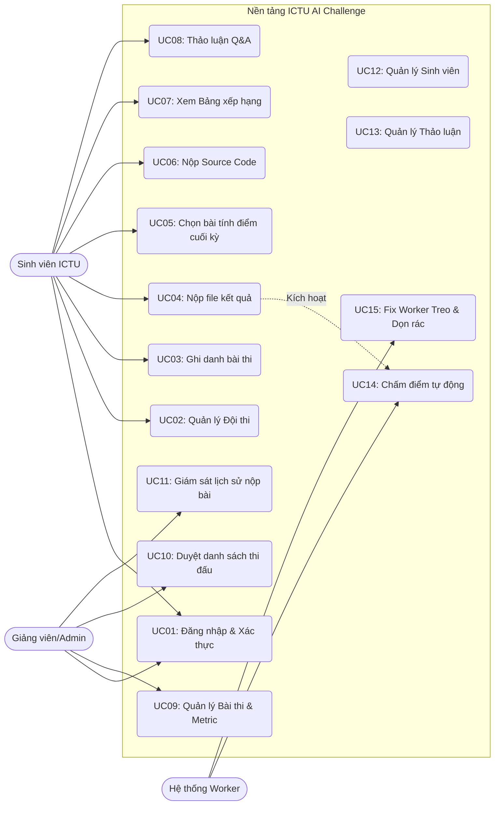

# Tài liệu Đặc tả Use Case (Use Case Specification - UC)
**Tên dự án:** Nền tảng Tổ chức và Luyện tập Olympic AI ICTU
**Ngày cập nhật:** 26/07/2026

Tài liệu này đặc tả chi tiết các tình huống sử dụng (Use Cases) của hệ thống dựa trên yêu cầu nghiệp vụ (BA) và thiết kế CSDL (ERD), có bao gồm các xử lý ngoại lệ (Edge Cases) thực tế.

---

## 1. Danh sách Tác nhân (Actors)

| Tác nhân | Mô tả |
| :--- | :--- |
| **Sinh viên (User)** | Cá nhân (có email `@ictu.edu.vn`) hoặc thành viên Đội thi tham gia giải quyết các bài toán AI. |
| **Giảng viên / Admin** | Người có quyền cao nhất trên hệ thống. Chịu trách nhiệm tạo đề thi, cấu hình bộ chấm điểm và quản lý cuộc thi. |
| **Hệ thống (System Worker)** | Tác nhân hệ thống ngầm. Tự động chấm điểm (evaluate), xử lý các job bị treo và dọn dẹp file rác. |

---

## 2. Sơ đồ Use Case Tổng quát

---

## 3. Danh sách Use Case (Use Case List)

### 3.1. Phân hệ Sinh viên (User)
- **UC01. Đăng nhập / Đăng ký:** Đăng nhập qua OAuth Google (bắt buộc đuôi `@ictu.edu.vn`).
- **UC02. Quản lý Đội thi:** Tạo đội, tạo mã mời Token, gia nhập đội.
- **UC03. Ghi danh bài thi:** Tự do tham gia các `PUBLIC` Challenge (tự động sinh Team of 1).
- **UC04. Nộp bài dự thi (Submit):** Upload file `.csv`, hệ thống validate chặt chẽ (MD5 Hash, format, dung lượng).
- **UC05. Chọn bài tính điểm Private:** Đánh dấu chọn (Đánh dấu V) tối đa 1-2 file nộp tốt nhất để chấm điểm chung cuộc (chống Overfitting).
- **UC06. Nộp Source Code:** Upload file Code (Jupyter/Python) + `requirements.txt` vào cuối kỳ.
- **UC07. Xem Bảng xếp hạng:** Xem rank thay đổi theo thời gian thực (Public).
- **UC08. Thảo luận (Q&A):** Viết bình luận/hỏi đáp trong trang chi tiết bài thi.

### 3.2. Phân hệ Quản trị (Admin)
- **UC09. Quản lý Bài thi:** Thêm, Sửa, Xuất bản, Cài đặt luật thi (Rate Limit, Số thành viên đội).
- **UC10. Quản lý Quyền thi đấu (Whitelist):** Gán quyền tham gia (Approve) cho kỳ thi `COMPETITION`.
- **UC11. Giám sát Nộp bài:** Tải về các file `.csv` hoặc file Code của các Đội đạt giải để hậu kiểm (Reproduce).
- **UC12. Quản lý Sinh viên:** Khóa tài khoản, mở khóa.
- **UC13. Quản lý Thảo luận:** Giải đáp các bình luận thắc mắc của sinh viên.

### 3.3. Phân hệ Hệ thống (System Worker)
- **UC14. Chấm điểm tự động:** Celery Worker lấy job từ Redis, khởi tạo Docker Sandbox chấm bài, cập nhật Leaderboard.
- **UC15. Fix Worker Treo & Dọn rác:** Cronjob quét các Submission kẹt trạng thái `PROCESSING` quá lâu và chuyển sang `FAILED`; xóa file CSV cũ giữ lại file tốt nhất.

---

## 4. Đặc tả chi tiết các Use Case cốt lõi (Core Specifications)

### Đặc tả UC04: Nộp bài dự thi (Sinh viên)
| Tiêu chí | Nội dung |
| :--- | :--- |
| **Mô tả** | Sinh viên upload file `.csv` dự đoán của model lên hệ thống để lấy điểm số (Score). |
| **Điều kiện tiên quyết** | Cuộc thi đang ở trạng thái `PUBLISHED` (`start_time` < Now < `end_time`). Đội thi không vi phạm giới hạn khoảng cách nộp bài `rate_limit_minutes`. |
| **Luồng sự kiện chính (Happy Path)** | 1. Chọn nút "Nộp bài", kéo thả file `submission.csv` vào khu vực upload. 2. Bấm "Submit". 3. **[Tối ưu]** Hệ thống băm mã Hash (MD5) của file để kiểm tra trùng lặp. 4. Hệ thống kiểm tra dung lượng (< max_size) và định dạng (.csv). 5. Tạo 1 record `SUBMISSION` với status `PENDING`. Báo "Nộp bài thành công". 6. Worker lấy file ra chấm -> Cập nhật điểm -> Cập nhật Leaderboard. |
| **Luồng ngoại lệ (Exceptions)** | - **E1 (Quá dung lượng / Lỗi format):** Báo lỗi ngay tại Frontend. - **E2 (Sai cấu trúc dữ liệu):** Worker đọc số cột/dòng không khớp Ground Truth -> Chuyển status `FAILED`, hiện `error_message`. - **E3 (Vi phạm Rate limit):** Báo lỗi "Vui lòng chờ X phút nữa để nộp lần tiếp theo". - **E4 (Trùng lặp file - Spam):** Báo lỗi "File này trùng với kết quả lần nộp trước (Trùng mã Hash MD5), vui lòng không nộp lại". - **E5 (Worker bị treo/chết):** File bị kẹt `PROCESSING` quá lâu sẽ được Cronjob (UC10) quét và chuyển thành `FAILED` để sinh viên có thể nộp lại. |

### Đặc tả UC09: Quản lý Bài thi & Metric (Admin)
| Tiêu chí | Nội dung |
| :--- | :--- |
| **Mô tả** | Admin khởi tạo một cuộc thi/bài toán mới, định nghĩa luật lệ và công cụ chấm điểm. |
| **Điều kiện tiên quyết** | Tài khoản có Role `ADMIN`. |
| **Luồng sự kiện chính (Happy Path)** | 1. Bấm "Tạo bài thi", nhập các thông tin mô tả, dán Link GG Drive Dataset. 2. Thiết lập Luật: Hạn nộp, Hạn chót lập Đội, Giới hạn Rate Limit, Giới hạn số thành viên (Max Team Size). 3. Cấu hình Chấm điểm: Chọn hàm chuẩn (Ví dụ: Accuracy, `metric_direction=HIGHER_IS_BETTER`) hoặc upload script `metric.py`. 4. Upload `Ground Truth.csv` (có cột Usage). 5. Lưu bài thi dưới dạng `DRAFT` hoặc `PUBLISHED`. |
| **Luồng ngoại lệ (Exceptions)** | - **E1 (Thiếu cột phân loại):** Upload file Ground Truth không có cột `Usage` -> Hệ thống bắt Admin sửa lại. - **E2 (Lỗi Script Metric):** Chạy thử Script Custom bị lỗi Syntax/Logic -> Bắt buộc sửa lại code Python. - **E3 (Khóa thay đổi Metric - Cực kỳ quan trọng):** Nếu cuộc thi đã `PUBLISHED` và **đã có ít nhất 1 bài được Submit thành công**, hệ thống sẽ KHÓA tính năng thay đổi hàm chấm điểm và upload lại Ground Truth để bảo vệ tính vẹn toàn của điểm số các sinh viên đã nộp. |

### Đặc tả UC02: Quản lý Đội thi - Sinh viên
| Tiêu chí | Nội dung |
| :--- | :--- |
| **Mô tả** | Các cá nhân liên kết lại thành Đội để làm bài chung (dùng chung lượt Submit). |
| **Luồng sự kiện chính (Happy Path)** | 1. Trưởng nhóm vào mục Đội thi -> Bấm "Mời thành viên". 2. Nhập Email ICTU của bạn bè. 3. Hệ thống sinh mã Token mã hóa, tạo record trong `TEAM_INVITE`, gửi mail hoặc Link mời. 4. Bạn bè click vào Link -> Xác thực Token hợp lệ. 5. Cập nhật `TEAM_MEMBER`, bạn bè chính thức vào đội. |
| **Luồng ngoại lệ (Exceptions)** | - **E1 (Quá hạn khóa đội):** Nếu đã qua `team_lock_deadline`, nút Mời bị ẩn/báo lỗi. - **E2 (Đã nộp bài - Cấm Kick):** Nếu đội ĐÃ có lịch sử nộp bài, Trưởng nhóm không thể "Đá" thành viên ra khỏi nhóm (bảo vệ tài sản code chung). - **E3 (Vượt quá số lượng Đội viên - Full Team):** Khi số lượng member = `max_team_size`, link mời cũ bị vô hiệu hóa. - **E4 (Lỗi giao thoa Đội):** Người nhận lời mời ĐÃ thuộc một Đội khác trong cùng bài thi đó -> Hệ thống chặn ngay lập tức và báo "Bạn đã thuộc một Đội thi khác, không thể tham gia 2 đội". |
