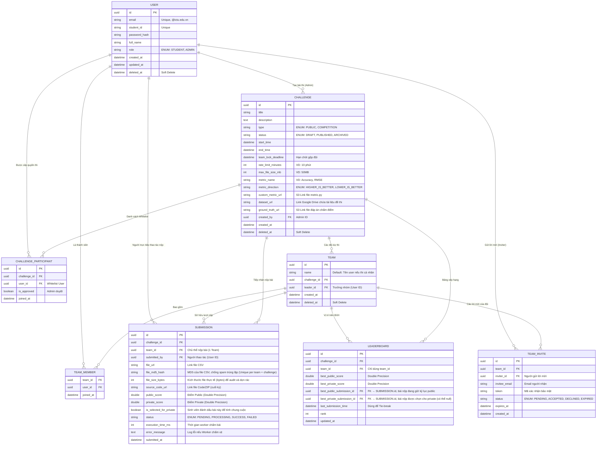

# Thiết kế Cơ sở dữ liệu (Entity Relationship Diagram - ERD)
**Tên dự án:** Nền tảng Tổ chức và Luyện tập Olympic AI ICTU
**Ngày cập nhật:** 26/07/2026

Dựa trên tài liệu Phân tích Nghiệp vụ (BA.md) và các tối ưu về chuẩn hóa CSDL cho hệ thống AI Judging thực tế (như Kaggle), dưới đây là thiết kế chi tiết CSDL cho hệ thống. CSDL đề xuất sử dụng là **PostgreSQL**.

---

## 1. Sơ đồ thực thể liên kết (Mermaid ERD)

---

## 2. Từ điển Dữ liệu (Data Dictionary)

### 2.1. Thiết kế "Team of 1" (Mô hình Đội thi đồng nhất)
Hệ thống sử dụng nguyên lý "Mọi cá nhân tham gia đều là 1 Đội có 1 thành viên". 
- Khi một user tự ghi danh thi đấu, hệ thống tự động sinh ra một `TEAM` lấy tên user đó và phân user vào `TEAM_MEMBER`.
- Bảng `SUBMISSION` và `LEADERBOARD` quản lý trực tiếp qua `team_id`, bỏ qua `user_id`, giúp logic Query đơn giản, hiệu suất cao.

### 2.2. Bảng `USER` & `TEAM` (Người dùng & Đội thi)
- Các bảng dữ liệu cốt lõi (`USER`, `TEAM`, `CHALLENGE`) đều hỗ trợ **Soft-Delete (Xóa mềm)** thông qua cột `deleted_at`.
- Bảng `TEAM` chứa `leader_id` chỉ định người trưởng nhóm có quyền quản lý thành viên.

### 2.3. Bảng `TEAM_INVITE` (Lời mời vào Đội)
Bảng quản lý quy trình ghép đội an toàn. Trưởng nhóm tạo mã mời, sinh viên khác click vào link/mã mời để gia nhập.
- `invitee_email`: Email của người được mời.
- `token`: Chuỗi hash bảo mật dùng trên URL chấp nhận lời mời.
- `expires_at`: Thời gian hết hạn của lời mời (ví dụ: sau 24h).
- Chỉ khi `status` cập nhật thành `ACCEPTED`, user mới được Insert vào bảng `TEAM_MEMBER`.

### 2.4. Bảng `CHALLENGE` (Bài toán / Cuộc thi)
- **`dataset_url`**: Lưu Link thư mục Google Drive chứa các file phục vụ quá trình làm bài của sinh viên (ví dụ: `dataset.zip`, `baseline.ipynb`, `public_submission.csv`, `best_model.pth`).
- **`ground_truth_url`**: Lưu File kết quả đáp án (`.csv`). File này được upload và mã hóa lưu kín ở Server/S3 để Worker đọc lúc chấm điểm. Sinh viên tuyệt đối không thể truy cập.
- **`metric_direction` (Chiều chấm điểm):** 
  - `HIGHER_IS_BETTER`: Dành cho các hàm Accuracy, F1 (Lấy điểm cao).
  - `LOWER_IS_BETTER`: Dành cho các hàm Error/Loss như RMSE (Lấy điểm thấp). Cực kỳ quan trọng để Leaderboard sắp xếp (ORDER BY) chuẩn xác.

### 2.5. Bảng `CHALLENGE_PARTICIPANT` (Danh sách tham gia)
Lưu danh sách sinh viên được phép tham gia một `COMPETITION` (Đóng vai trò Whitelist để Admin kiểm duyệt).

### 2.6. Bảng `SUBMISSION` (Lượt nộp bài)
Bảng cốt lõi với tần suất Insert (Ghi) cực cao trong lúc thi.
- **Precision Score:** Các trường điểm (`public_score`, `private_score`) bắt buộc sử dụng kiểu `DOUBLE PRECISION` (hoặc `DECIMAL(10,6)`) để tránh sai số thập phân ở những thứ hạng sát nút.
- `submitted_by`: Ai là người thực sự bấm nút Upload file trong Đội.
- **`file_md5_hash`**: Hash MD5 của file CSV nộp bài. Dùng để **chống spam** (Anti-Spam): Nếu một Team nộp cùng 1 file đã tồn tại, hệ thống trả `HTTP 409` ngay tại Use Case layer, không tốn tài nguyên Worker. Cần tạo Unique Index trên `(challenge_id, team_id, file_md5_hash)`.
- **`file_size_bytes`**: Kích thước thực tế của file (bytes). Hỗ trợ chức năng **Storage Retention** (tự động xóa file cũ) và audit log khi có tranh chấp dụng lượng.
- `execution_time_ms`: Lưu lại thời gian (mili-giây) Worker chạy hàm chấm điểm. Giúp Admin phát hiện những Script (`metric.py`) bị lỗi lặp vô hạn hoặc tốn tài nguyên quá đáng.
- `is_selected_for_private`: **Chống Overfitting.** Sinh viên được quyền tick chọn file kết quả (CSV) ưng ý nhất để chấm điểm chung cuộc.

### 2.7. Bảng `LEADERBOARD` (Bảng xếp hạng lưu trữ hóa)
Bảng này là một **Materialized View** (Bảng được lưu trữ vật lý) giúp query xếp hạng cực nhanh lúc cao điểm.
- Update bất đồng bộ: Khi Worker chấm xong `SUBMISSION`, nó đối chiếu `metric_direction` xem điểm vừa nhận có phải là kỷ lục mới của Đội không, nếu có thì Update bản ghi này.
- **`best_public_submission_id`**: FK trỏ tới bản ghi `SUBMISSION` đang giữ kỷ lục public hiện tại. Cho phép Admin tải đúng file CSV tốt nhất của từng Đội mà không cần query toàn bộ SUBMISSION.
- **`best_private_submission_id`**: FK trỏ tới bài được chọn cho Private Leaderboard. Giá trị này có thể `NULL` (khi sinh viên chưa tick chọn). Hệ thống dùng `best_public_submission_id` làm Fallback khi `best_private_submission_id` là NULL.
- **Tie-break (Đồng hạng):** Dựa vào `last_submission_time`. Nếu điểm bằng nhau, hệ thống ưu tiên Đội có mốc thời gian này sớm hơn.
